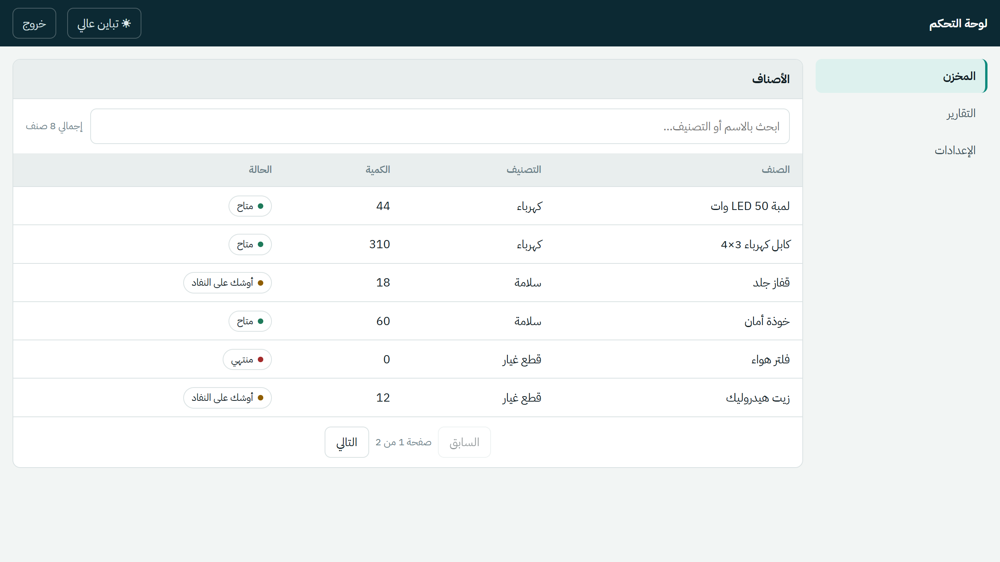
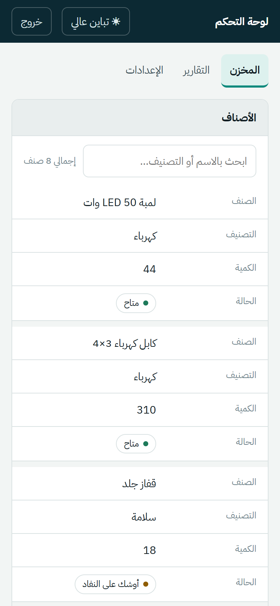
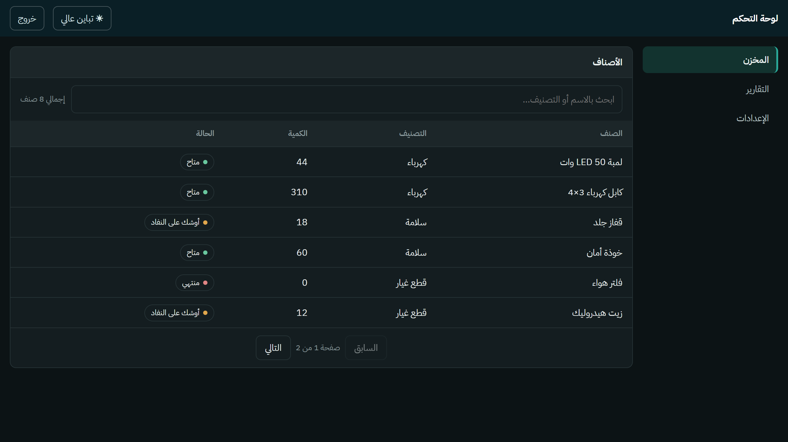
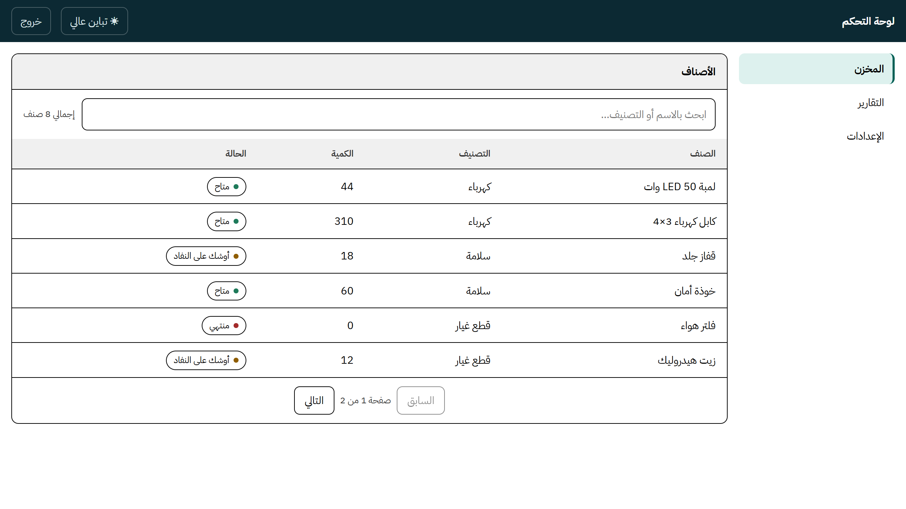

# rtl-admin-starter

A small admin dashboard starter for Arabic, right-to-left interfaces, built on
FastAPI with a framework-free front end.

> **Not the MGICO system.** This is a separate, newly written template with demo
> data. It shares no code or data with the operations platform I built for MGICO,
> which stays private — see the [MGICO showcase](https://github.com/YoussefKabbary/mgico-showcase)
> for screenshots and an overview of that system.

Most admin templates are left-to-right first. Setting `direction: rtl` on the
body makes a page look Arabic, but the details stay broken: a version number or
a file path inside an Arabic sentence pulls its punctuation to the wrong end,
numbers in a table stop lining up, and every left/right padding needs a mirrored
override. This starter is built RTL-first instead, and it ships the two pieces
that are tedious to get right on every new project: a locked-by-default auth
gate and a table that works on a phone.

<p align="center">
  
  &nbsp;
  
</p>

## What is inside

**RTL done at the root, not patched on top**
- `dir="rtl"` on `<html>`, so the scrollbar, focus order and selection follow it.
- Logical CSS properties throughout (`padding-inline-start`, `border-inline-start`),
  no physical left/right rules to mirror.
- Latin fragments inside Arabic text use `unicode-bidi: isolate`, and numeric
  columns use tabular figures so digits line up.

**A table that becomes cards on a phone**
- One markup, two layouts. Every cell carries a `data-label`, and under 620 px
  CSS turns each row into a labelled card. There is no second mobile template to
  keep in sync.
- Search and pagination run on the server. The API returns the rows, the total
  and the page count, so the browser never holds more than one page.

**Closed by default**
- One application-wide dependency authenticates every route. A path is public
  only if it is listed in `PUBLIC_PATHS`.
- `tests/test_auth_gate.py` calls every route without a token and expects 401,
  and keeps its own copy of the public list. Opening a new path means editing
  both, so the decision shows up in review instead of slipping through.
- Signed, expiring tokens compared with `hmac.compare_digest`; PBKDF2 password
  hashing; the login does the same work for unknown usernames so response time
  does not reveal which accounts exist.

**Readable outdoors**
- Light and dark themes follow the system setting.
- A high-contrast "sun" mode for phones used in direct sunlight, with 40 to 44 px
  touch targets.

<p align="center">
  
  &nbsp;
  
</p>

**Safe by default in the small things**
- Every value is HTML-escaped before it reaches the page.
- Input is validated by Pydantic (no negative quantities, fixed status values).
- SQL is parameterized; the search box is a bound parameter.

## Run it

```bash
python -m venv .venv
.venv\Scripts\activate          # Windows
# source .venv/bin/activate     # macOS / Linux
pip install -r requirements.txt
python app.py
```

Open <http://127.0.0.1:8099> and sign in with `admin` / `admin123`.
The demo creates `data.db` (SQLite) with a few sample inventory rows on first run.

Change these before using it for anything real:

| Variable | Purpose |
|---|---|
| `RTL_ADMIN_SECRET` | Token signing key. Long and random; tokens stop working if it changes. |
| `RTL_ADMIN_USERNAME` / `RTL_ADMIN_PASSWORD` | The admin account. |
| `RTL_ADMIN_TOKEN_TTL` | Token lifetime in seconds (default 12 hours). |
| `RTL_ADMIN_DB` | Path to the SQLite file. |

## Tests

```bash
pytest
ruff check .
```

12 tests cover the auth gate, token forgery and expiry, search in Arabic,
pagination bounds, CRUD, validation, and SQL injection through the search box.
Each test runs against its own temporary database.

## Project layout

```
app.py              API, auth gate, SQLite storage
templates/index.html
static/rtl.css      RTL-first styles, themes, phone cards
static/app.js       login, table, search, pagination
tests/              pytest suite
docs/               screenshots
```

## Where it comes from

I build operations software for Arabic-speaking teams who work on site, mostly
from a phone. These are the patterns I kept rewriting at the start of each
project, collected into one place. It is written from scratch and contains no
client code or data — in particular, none from the MGICO platform.

---

<div dir="rtl">

### بالعربي

قالب صغير للوحة تحكم عربية من اليمين للشمال على FastAPI، من غير أي مكتبة
واجهة. الاتجاه مظبوط من الجذر، والجدول بيتحوّل لكروت على الموبايل، وكل الصفحات
مقفولة افتراضيًا إلا اللي بتتفتح صراحةً، ومعاه اختبارات بتتأكد من ده.

</div>

## License

© 2026 Youssef Kabbary. All rights reserved. See [LICENSE](LICENSE).
